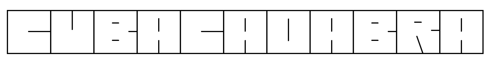

# Cubacadabra font

Cubacadabra is a decorative display font built from the square, edge-joining
alphabet shown in the original `alpha.png` and `11.png` references. It is an
early preview, version **0.1.0** (OpenType version **0.100**), with one Regular
face.

Uppercase and lowercase Latin letters retain their normal text mappings but
share the same square glyph designs. Each glyph advances 750 font units in a
1000-unit em; the 20-unit side strokes meet at the advance boundary. Use normal
tracking so adjoining letters touch. The A and H, and C and F, designs remain
distinct. Digits, punctuation, and selected symbols use conventional outlines
based on Arimo Regular. The font covers **144 Unicode characters**: printable
ASCII, nonbreaking space, and common punctuation, currency, and math symbols.
See [the full character list](specimen/characters.txt). Accented letters and
other scripts are not included.



Use Cubacadabra for short display text such as titles, labels, and logos. It is
best at 32 CSS pixels or larger. Keep words intact; do not add letter spacing,
justify text, or request a synthetic bold weight, since those treatments can
break the continuous borders. The font has a Regular face only.

## Files

- `fonts/Cubacadabra-Regular.ttf` — installable desktop font.
- `fonts/Cubacadabra-Regular.woff2` — web font.
- `fonts/cubacadabra.css` — self-hosted CSS declaration.
- `specimen/index.html` — editable local specimen.
- `specimen/cubacadabra.svg` and `specimen/alphabet.svg` — generated samples.
- `specimen/cubacadabra.png` and `specimen/alphabet.png` — rendered font proofs.
- `release/Cubacadabra-0.1.0.zip` — assembled release archive.
- `sources/alphabet.py` and `scripts/build.py` — editable alphabet source and
  build generator.
- `sources/vendor/` — Arimo source font, its license, and provenance notes.
- `OFL.txt` — license and copyright notices for the distributed font.

Build outputs are generated locally and may not exist in a fresh source
checkout until the build command runs.

## Install the desktop font

Use `fonts/Cubacadabra-Regular.ttf` for desktop installation.

- **macOS:** open the TTF in Font Book and choose **Install**.
- **Windows:** right-click the TTF and choose **Install** (or **Install for all
  users** if appropriate).
- **Linux:** copy it to `~/.local/share/fonts/`, then run `fc-cache -f` in a
  terminal. Applications may need to be restarted to see it.

The operating system or application may offer its own font installation
workflow. For redistribution, keep the accompanying license and attribution
files with the font package.

## Use on the web

Host the WOFF2 file yourself and load the generated stylesheet:

```html
<link rel="stylesheet" href="/fonts/cubacadabra.css">
```

Then apply the declared `Cubacadabra` family to short display text. If writing
your own `@font-face` rule, use `font-display: swap` so fallback text can appear
while the web font loads. A typical declaration is:

```css
@font-face {
  font-family: "Cubacadabra";
  src: url("/fonts/Cubacadabra-Regular.woff2") format("woff2");
  font-style: normal;
  font-weight: 400;
  font-display: swap;
}

.display-wordmark {
  font-family: "Cubacadabra", sans-serif;
  font-size: 2rem;
  font-weight: 400;
  font-synthesis: none;
  letter-spacing: 0;
  text-align: left;
}
```

Use the actual deployed URL for the WOFF2 file. Keep the same font size and
weight throughout each connected word. The border extends 0.01 em beyond the
first and last glyph's advance, so leave a little padding when clipping text.

To try the specimen, open `specimen/index.html`. If your browser blocks local
font loading, run `python3 -m http.server 8000 --bind 127.0.0.1` from this
directory and open `http://127.0.0.1:8000/specimen/`.

## Build from source

Python 3 is required. The pinned build and rendering dependencies are in
`requirements.txt`.

```sh
python3 -m venv .venv
.venv/bin/python -m pip install -r requirements.txt
.venv/bin/python scripts/build.py
.venv/bin/python scripts/verify.py
```

The build generates TTF and WOFF2 files, SVG/PNG specimens, a character list,
and the release ZIP with checksums. The CSS and HTML are editable source files.
The vendored Arimo font is pinned and verified by SHA-256; rebuilding needs no
network access once Python dependencies are installed. Font timestamps and ZIP
entries use a fixed release date for repeatable output.

Verification completed on macOS: all 26 distinct letter shapes, complete
printable ASCII, matching TTF/WOFF2 outlines, unclipped vertical metrics,
FreeType rendering with equal outer/shared border thickness, HarfBuzz and
CoreText shaping, and release archive integrity. Chrome loaded the WOFF2 and
the editable specimen at 390, 768, 1280, and 1440 px widths without page
overflow. Desktop installation in Windows apps, Safari, and other hosts has
not been verified.

## Release notes for maintainers

The recommended first distribution is a **versioned GitHub Release** with the
prepared ZIP and `release/SHA256SUMS.txt`. People can install the TTF directly
or self-host the small WOFF2 using the included CSS; a font service is optional.
Keep the source repository available so others can reproduce or adapt the font.

The package uses **SIL OFL 1.1**, includes both Cubacadabra and Arimo attribution,
and embeds the license in the font metadata. No Reserved Font Names are
declared. OFL allows use in commercial designs and bundling with software;
redistributed font software keeps its license and notices, and the font cannot
be sold by itself. See the [official OFL FAQ](https://openfontlicense.org/ofl-faq/).

For each release, increment both the archive version and OpenType version in
`scripts/build.py`, update the release date and FontLog, then run the checks
and inspect the font in the desktop/web apps you intend to support. Preserve
old releases; changed bytes get a new version. The included package carries
fonts, license/credits, specimens, source, and build instructions. This preview
has been prepared locally and has not been uploaded.

Google Fonts is a later, separate review path. Its
[requirements](https://googlefonts.github.io/gf-guide/requirements.html)
include broader Latin Core coverage for Latin families; this A–Z display preview
does not yet provide that coverage. Follow the
[submission process](https://github.com/google/fonts/blob/main/CONTRIBUTING.md)
after extending coverage and running the catalog's quality checks.

## References

- [OpenType naming table](https://learn.microsoft.com/en-us/typography/opentype/spec/name)
  describes family, subfamily, and version strings used in font metadata.
- [MDN: `font-display`](https://developer.mozilla.org/en-US/docs/Web/CSS/Reference/At-rules/%40font-face/font-display)
  documents web font loading behavior.
- [SIL Open Font License FAQ](https://openfontlicense.org/ofl-faq/) explains
  distribution, web font use, and attribution requirements.
- [Google Fonts contribution guide](https://github.com/google/fonts/blob/main/CONTRIBUTING.md)
  describes that catalog's separate contribution and review process.
